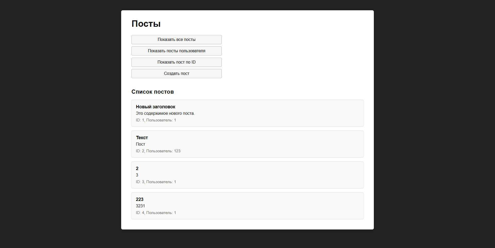

A simple application for posts

A web client and a server for managing posts (analogous to jsonplaceholder). You can view, search, and create posts through a user-friendly interface.

## 🖼️ Interface mockup



---

## 🚀 Quick Start

1. **Clone the repository and navigate to the project folder:**

```bash

git clone https://github.com/1MaxSpb/JS.git

cd env-task-3

```

2. **Install the dependencies:**

```bash

npm install

```

3. **Start the server:**

```bash

npm start

```

4. **Open it in a browser:**

[http://localhost:3000/](http://localhost:3000/)

---

## 📁 Project structure

- `index.js` — the main Express server

- `index.html ` — home page (frontend)

- `main.js` — logic of working with API and DOM

-`styles.css` — interface styling

- `postsController.js` — API handlers for posts

-`data/posts.json` — posts data (created automatically)

-`openapi.yaml` — API description (OpenAPI 3.0)

---

## 🛠️ API Examples

-`GET /posts` — get all posts

-`GET /posts/:id` — get a post by ID

- `GET /users/:userId/posts` — user posts

-`POST/posts` — create a post (body: `{userId, title, body }`)

-`PUT /posts/:id` — update the post

-`DELETE /posts/:id` — delete a post

**An example of a body for creating a post:**

```json

{

"userId": 1,

"title": "Title",

"body": "Post text"

}

```

---

## 📝 Data initialization

- At the first launch, the `data/posts.json` file is created automatically.

- You can add your posts manually or through the interface.

---

## 📦 Requirements

- Node.js >= 16

- npm

---

## 🤝 Authors and license

- A project for educational purposes

- License: ISC
